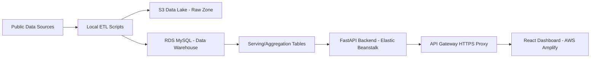

# COVID Cloud ETL Pipeline & Data Lake Dashboard

Đề tài: **Xây dựng Cloud Data Pipeline (ETL) & Data Lake** cho dữ liệu COVID-19.

Dự án này mô phỏng một hệ thống dữ liệu trên cloud gồm: thu thập dữ liệu thô, lưu trữ Data Lake, xử lý ETL, nạp vào Data Warehouse, tạo Serving Layer và hiển thị dashboard web. Mục tiêu chính là chứng minh luồng dữ liệu có thể đi từ nguồn công khai đến dashboard triển khai trên AWS.

## Demo

- Frontend dashboard: https://main.d3jroqzoky30e6.amplifyapp.com
- Backend API qua HTTPS proxy: https://hxp3go3lkd.execute-api.ap-southeast-1.amazonaws.com
- API kiểm tra nhanh: https://hxp3go3lkd.execute-api.ap-southeast-1.amazonaws.com/api/summary/global

## Mục Tiêu Dự Án

- Xây dựng pipeline ETL cho dữ liệu COVID-19 toàn cầu và Việt Nam.
- Tổ chức dữ liệu thô theo mô hình **Data Lake**.
- Chuyển đổi dữ liệu thành các bảng phân tích trong **Data Warehouse**.
- Tạo **Serving Layer** để frontend/API đọc nhanh.
- Triển khai hệ thống lên AWS theo hướng cloud-native cơ bản.
- Cung cấp dashboard trực quan để nhóm dùng làm demo, báo cáo Word và slide thuyết trình.

## Kiến Trúc Tổng Quan



## Thành Phần AWS

| Thành phần | Dịch vụ AWS | Vai trò |
| --- | --- | --- |
| Data Lake | Amazon S3 | Lưu dữ liệu thô theo vùng `raw/` |
| Data Warehouse | Amazon RDS MySQL | Lưu schema, fact table, dimension table, aggregate table |
| Backend API | AWS Elastic Beanstalk | Chạy FastAPI bằng Docker |
| HTTPS API Proxy | Amazon API Gateway | Cung cấp endpoint HTTPS cho frontend |
| Frontend | AWS Amplify Hosting | Deploy dashboard React/Vite |

## Nguồn Dữ Liệu

- **OWID COVID-19 Dataset**: dữ liệu COVID-19 toàn cầu.
- **Dữ liệu COVID-19 Việt Nam theo tỉnh/thành**: dùng để xây thêm phần phân tích Việt Nam.
- **Dữ liệu tiêm chủng Việt Nam theo địa phương**: dùng cho bản đồ nhiệt và bảng so sánh tỉnh/thành.
- **Wikipedia COVID-19 tại Việt Nam**: dùng để bổ sung dữ liệu ca mắc/tử vong Việt Nam theo thời gian và địa phương.

Dữ liệu thô được đặt trong:

```text
data/raw/
```

Một số file lớn như `owid-covid-data.csv` có thể không được commit lên Git để tránh nặng repo. Nếu thiếu file, script `extract.py` có thể tải lại dữ liệu OWID.

## Luồng Pipeline

### 1. Extract

Script chính:

```text
extract.py
vn_vaccination_load.py
vn_wikipedia_load.py
```

Nhiệm vụ:

- Đọc hoặc tải dữ liệu nguồn.
- Chuẩn hóa encoding/cột dữ liệu.
- Lưu dữ liệu thô vào các bảng raw trong MySQL.
- Đồng thời dữ liệu thô được tổ chức trong S3 Data Lake.

### 2. Transform

Script chính:

```text
transform_load.py
```

Nhiệm vụ:

- Làm sạch dữ liệu COVID toàn cầu.
- Loại bỏ dòng không phải quốc gia thật.
- Chuẩn hóa ngày, quốc gia, chỉ số ca nhiễm/tử vong/tiêm chủng.
- Tạo dimension table và fact table.

### 3. Load

Dữ liệu sau transform được nạp vào RDS MySQL:

- `dim_country`
- `dim_date`
- `dim_province`
- `fact_covid_global_daily`
- `fact_covid_vn_daily`
- `fact_vn_vaccination`
- `fact_vn_wikipedia_daily`

### 4. Serving Layer

Các bảng tổng hợp phục vụ dashboard:

- `agg_country_summary`
- `agg_daily_global`
- `agg_daily_vn`
- `agg_vn_province_summary`
- `agg_vn_vaccination_summary`
- `agg_vn_wikipedia_province_cases`
- `etl_job_log`

Frontend và API ưu tiên đọc từ các bảng aggregate này để giảm tải truy vấn.

## Cấu Trúc Thư Mục

```text
.
├── covid-frontend/              # React/Vite dashboard
├── data/
│   └── raw/                     # Local raw data snapshots
├── deploy/                      # File zip/backend artifact khi deploy
├── docs/                        # Tài liệu triển khai cloud
├── tools/                       # Script/công cụ phụ trợ
├── extract.py                   # Extract dữ liệu OWID
├── transform_load.py            # Transform + load global COVID data
├── vn_vaccination_load.py       # Load dữ liệu tiêm chủng Việt Nam
├── vn_wikipedia_load.py         # Load dữ liệu COVID Việt Nam từ Wikipedia
├── refresh_serving.py           # Refresh bảng serving/aggregation
├── main.py                      # FastAPI backend
├── schema.sql                   # MySQL schema
├── db_config.py                 # Đọc cấu hình DB từ environment variables
├── Dockerfile                   # Container backend cho Elastic Beanstalk
├── amplify.yml                  # Cấu hình build frontend trên Amplify
└── requirements.txt             # Python dependencies
```

## Backend API

Backend dùng FastAPI, đọc dữ liệu từ RDS MySQL.

Một số endpoint chính:

| Endpoint | Ý nghĩa |
| --- | --- |
| `/health` | Kiểm tra backend |
| `/api/summary/global` | Tổng quan COVID toàn cầu |
| `/api/countries/top` | Top quốc gia theo ca nhiễm |
| `/api/trends/global` | Xu hướng ca nhiễm/tử vong toàn cầu |
| `/api/summary/vietnam` | Tổng quan dữ liệu Việt Nam |
| `/api/vietnam/provinces` | Dữ liệu tiêm chủng theo địa phương |
| `/api/vietnam/cases/summary` | Tổng quan ca mắc Việt Nam |
| `/api/vietnam/cases/trends` | Xu hướng ca mắc Việt Nam |
| `/api/etl/jobs` | Nhật ký ETL |
| `/api/assistant/health` | Trợ lý y tế rule-based |

## Frontend Dashboard

Frontend dùng:

- React
- Vite
- Recharts
- Lucide icons

Các phần chính:

- Tab **Toàn cầu**: KPI, line chart, bar chart, top quốc gia.
- Tab **Việt Nam**: dữ liệu tiêm chủng, bản đồ nhiệt Việt Nam, ca mắc theo thời gian.
- Tab **Nhật ký ETL**: theo dõi các job ETL đã chạy.
- Trợ lý y tế AI/rule-based: trả lời thông tin tham khảo về COVID-19.

## Chạy Local

### 1. Cài Python dependencies

```powershell
pip install -r requirements.txt
```

### 2. Tạo database local

```powershell
mysql -u root -p -e "CREATE DATABASE IF NOT EXISTS covid_dashboard;"
Get-Content .\schema.sql | mysql -u root -p covid_dashboard
```

### 3. Cấu hình biến môi trường

Tạo file `.env` hoặc set trực tiếp:

```text
MYSQL_HOST=localhost
MYSQL_PORT=3306
MYSQL_USER=root
MYSQL_PASSWORD=your-password
MYSQL_DATABASE=covid_dashboard
```

### 4. Chạy ETL

```powershell
python .\extract.py
python .\transform_load.py
python .\vn_vaccination_load.py
python .\vn_wikipedia_load.py
```

### 5. Chạy backend

```powershell
python -m uvicorn main:app --reload --port 8000
```

Backend local:

```text
http://127.0.0.1:8000
```

### 6. Chạy frontend

```powershell
cd covid-frontend
npm install
npm run dev
```

Frontend local:

```text
http://localhost:5173
```

## Triển Khai Cloud

### Data Lake - Amazon S3

Bucket:

```text
covid-etl-datalake-cloud-2026
```

Cấu trúc:

```text
raw/
├── owid/
│   └── owid-covid-data.csv
└── vietnam/
    ├── covid19-provinces_vn_vi_v2.csv
    └── vn_vaccination_by_locality.csv
```

### Data Warehouse - Amazon RDS MySQL

Database:

```text
covid_dashboard
```

RDS chứa toàn bộ schema, raw table, fact table, dimension table và aggregate table.

### Backend - Elastic Beanstalk

Backend được đóng gói bằng Docker và deploy lên Elastic Beanstalk.

Environment variables cần có:

```text
MYSQL_HOST
MYSQL_PORT
MYSQL_USER
MYSQL_PASSWORD
MYSQL_DATABASE
```

Không commit mật khẩu thật vào GitHub.

### API Gateway

API Gateway được dùng làm HTTPS proxy cho backend Beanstalk để frontend Amplify có thể gọi API an toàn qua HTTPS.

Base URL hiện tại:

```text
https://hxp3go3lkd.execute-api.ap-southeast-1.amazonaws.com
```

### Frontend - Amplify

Amplify build frontend từ thư mục:

```text
covid-frontend
```

Biến môi trường:

```text
VITE_API_BASE=https://hxp3go3lkd.execute-api.ap-southeast-1.amazonaws.com
```

Build command:

```text
npm run build
```

Output directory:

```text
dist
```

## Kết Quả Hiện Tại

- Data Lake trên S3 đã có dữ liệu raw.
- RDS MySQL đã có dữ liệu toàn cầu và Việt Nam.
- Backend FastAPI đã deploy và đọc được dữ liệu từ RDS.
- API Gateway HTTPS proxy đã hoạt động.
- Frontend Amplify đã deploy để nhóm có thể mở dashboard qua link public.

## Gợi Ý Cho Báo Cáo Word Và Slide

Nhóm có thể triển khai báo cáo theo bố cục:

1. Giới thiệu đề tài và bài toán.
2. Nguồn dữ liệu COVID-19.
3. Kiến trúc Cloud Data Pipeline.
4. Thiết kế Data Lake trên S3.
5. Thiết kế Data Warehouse trên RDS MySQL.
6. Quy trình ETL: Extract, Transform, Load.
7. Serving Layer và API.
8. Dashboard trực quan hóa.
9. Triển khai AWS: S3, RDS, Elastic Beanstalk, API Gateway, Amplify.
10. Kết quả đạt được, hạn chế và hướng phát triển.

Các ảnh nên chụp để đưa vào báo cáo/slide:

- S3 bucket và thư mục `raw/`.
- RDS database/tables.
- Elastic Beanstalk health OK.
- API Gateway endpoint test JSON.
- Amplify deployed.
- Dashboard chạy public.

## Lưu Ý Chi Phí

Sau khi demo/chấm bài xong, nên tắt hoặc xóa các tài nguyên AWS không cần dùng để tránh phát sinh chi phí:

- RDS MySQL instance
- Elastic Beanstalk environment
- API Gateway nếu không dùng nữa
- Amplify app nếu không cần hosting
- Dữ liệu trong S3 bucket nếu không cần lưu

## Trạng Thái

Phần triển khai chính của đề tài **Cloud Data Pipeline (ETL) & Data Lake** đã hoàn thiện ở mức demo cuối kỳ:

- Có dữ liệu thô.
- Có Data Lake.
- Có ETL.
- Có Data Warehouse.
- Có Serving Layer.
- Có API.
- Có dashboard public trên AWS.
